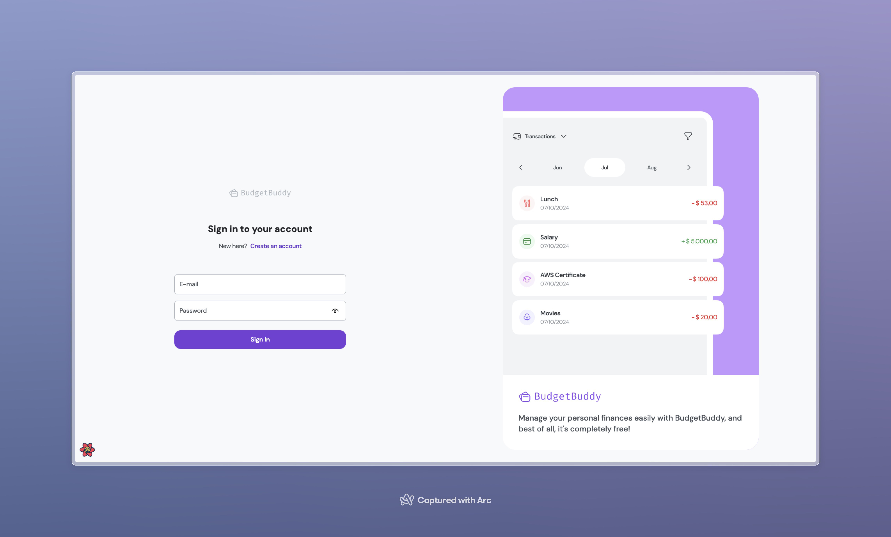
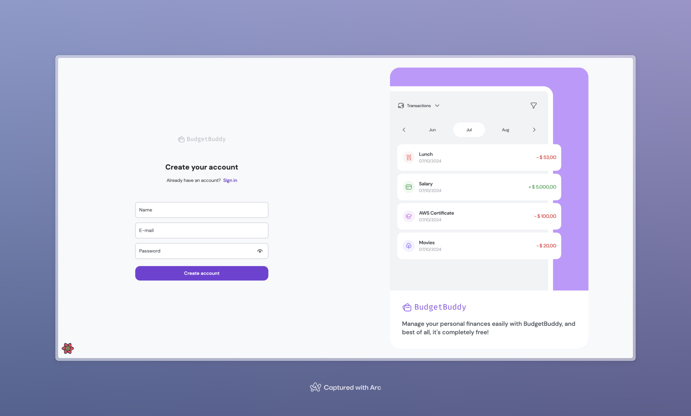
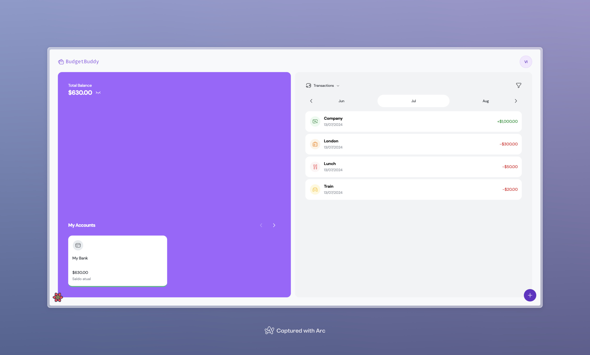
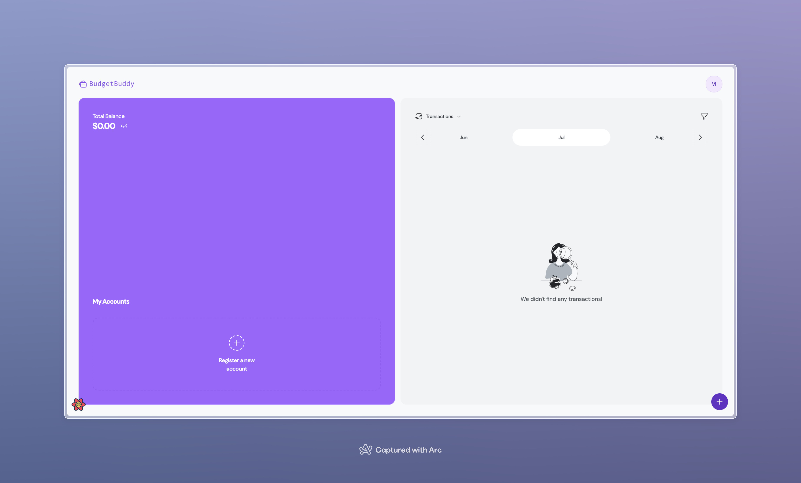

# BudgetBuddy

BudgetBuddy is a personal finance management application built with modern web technologies to help you track your expenses and income seamlessly.

## Screenshots






## Features

- User authentication (sign in and sign up)
- Track expenses and income
- View transactions by month
- Simple and clean UI

## Tech Stack

### Frontend

- **React**: A JavaScript library for building user interfaces
- **TailwindCSS**: A utility-first CSS framework
- **RadixUI**: Unstyled, accessible components for building high-quality design systems and web apps
- **React Query**: Data-fetching library to manage server-state in React

### Backend

- **NestJS**: A progressive Node.js framework for building efficient, reliable, and scalable server-side applications
- **Prisma**: A next-generation ORM for Node.js and TypeScript
- **PostgreSQL**: A powerful, open-source object-relational database system

## Getting Started

### Prerequisites

- Node.js (>=18.x)
- Yarn package manager
- PostgreSQL

### Installation

#### Frontend

1. Clone the repository:
    ```bash
    git clone https://github.com/VitornscSilva/budgetbuddy.git
    ```
2. Navigate to the frontend directory:
    ```bash
    cd budgetbuddy/frontend
    ```
3. Install dependencies:
    ```bash
    yarn install
    ```
4. Create a `.env` file in the root of the frontend directory and add the following:
    ```env
    VITE_API_URL=http://localhost:3000
    ```    
5. Start the development server:
    ```bash
    yarn dev
    ```

#### Backend

1. Navigate to the backend directory:
    ```bash
    cd budgetbuddy/api
    ```
2. Create a PostgreSQL database.
3. Create a `.env` file in the root of the backend directory and add the following:
    ```env
    DATABASE_URL=postgresql://<username>:<password>@<host>:<port>/<database>
    JWT_SECRET=your_jwt_secret
    ```
4. Install dependencies:
    ```bash
    yarn install
    ```
5. Start the development server:
    ```bash
    yarn start:dev
    ```
